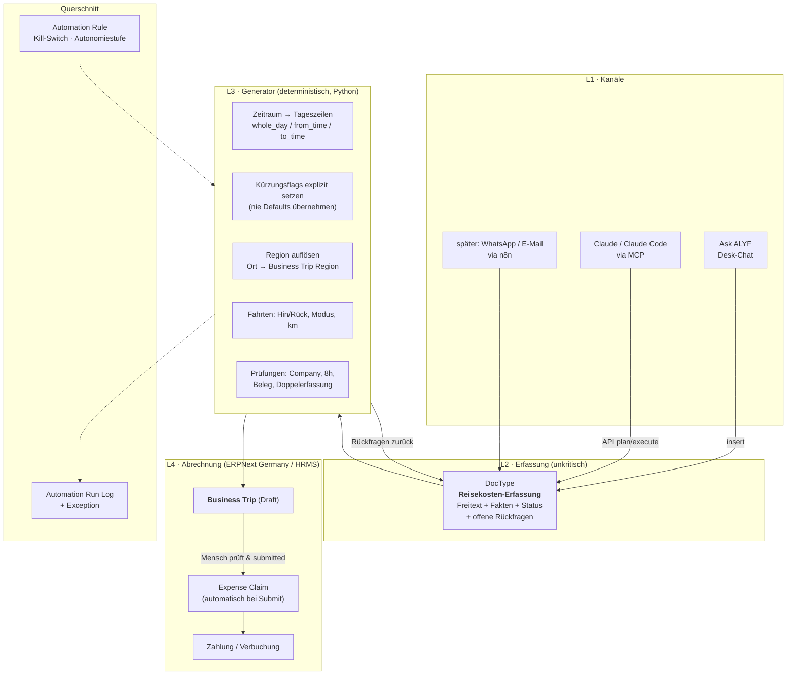

# KI-gestützte Reisekosten- und Spesenabrechnung in ERPNext

**Konzept · Stand 13.08.2026 · Auftraggeber: Alexander Finkeißen · System: axessio.de (Frappe Cloud v15)**

Ziel: Ein Satz wie

> „Erstelle die Spesenabrechnung für meine Fahrt von heute morgen 8 Uhr bis 17 Uhr nach
> Baden-Baden wegen Bauvorhaben Baden-Baden."

erzeugt — nach gezielten Rückfragen der KI — eine vollständige, steuerlich anerkennungsfähige
Reisekostenabrechnung in ERPNext. Bedienbar über **Ask ALYF** (Chat im Desk) **und** über
**Claude** (MCP / Claude Code), mit identischem Ergebnis.

---

## 1. Kurzfassung des Ergebnisses

1. **ERPNext bringt die Fachlogik bereits mit.** Die App *ERPNext Germany* (ALYF GmbH) ist
   installiert und enthält mit dem DocType **Business Trip** eine vollständige deutsche
   Reisekostenabrechnung: Verpflegungspauschalen nach § 9 Abs. 4a EStG, Kürzung bei gestellten
   Mahlzeiten (20/40/40 %), 8-Stunden-Regel, Kilometerpauschale, Übernachtungen, sonstige Kosten
   mit Belegen, und beim Submit automatisch einen **Expense Claim** (HRMS).
   **Es muss kein Abrechnungs-DocType neu gebaut werden.**
2. **Was fehlt, ist nicht die Rechnung, sondern der Weg dorthin:** Konfiguration (aktuell
   0,00 €/km!), das Anlegen der Tageszeilen, die Rückfragen, die Plausibilitätsprüfungen und
   ein Druckbeleg.
3. **Ein passendes Open-Source-Modul existiert nicht.** Weder ask_alyf, changAI, MCP-Server noch
   die vorhandenen Expense-Apps decken die deutsche Reisekostensystematik per Sprachdialog ab.
   Wir bauen also ein neues Modul — aber ein schlankes, das auf ERPNext Germany aufsetzt.
4. **Architekturleitsatz: Die KI ermittelt Fakten, der Server rechnet und bucht.**
   Kein Pauschalbetrag wird jemals von einem Sprachmodell berechnet. Das ist die Bedingung
   dafür, dass die Abrechnung steuerlich haltbar ist.

---

## 2. Bestandsaufnahme — was im System schon da ist

Geprüft am 13.08.2026 direkt auf der Produktivinstanz.

### 2.1 Vorhandene Bausteine

| Baustein | App | Eignung |
|---|---|---|
| **Business Trip** (+ Journey, Accommodation, Allowance, Other Expense) | erpnext_germany | ★★★ **Kern der Lösung** |
| **Business Trip Region** + Region Allowance | erpnext_germany | ★★★ BMF-Sätze inkl. 2026-Werte bereits eingespielt |
| **Business Trip Settings** (Single) | erpnext_germany | ★★★ nötig, aber **derzeit leer** |
| **Expense Claim** (+ Type, Detail, Advance, Taxes) | hrms | ★★☆ Verbuchung/Erstattung; wird automatisch erzeugt |
| **Travel Request** / Travel Itinerary | hrms | ★☆☆ *Antrag* vor der Reise, keine Abrechnung — nicht Teil der Lösung |
| **Vehicle Log** | hrms | ★☆☆ Fuhrpark-Kilometer, kein Fahrtenbuch i. S. d. § 6 EStG |
| **Ask ALYF** (Chat, Agent Mode, Skills) | ask_alyf | ★★★ Kanal 1 (Desk-Chat) |
| **Frappe Assistant Core** (MCP) | frappe_assistant_core | ★★★ Kanal 2 (Claude / Claude Code) |
| Automation Rule / Run Log / Exception | axessio | ★★★ Governance, Pflicht laut Entwicklungsprozess |
| axessio Feature | axessio | ★★★ Reifegrad-Backlog, Pflicht vor Baubeginn |

### 2.2 Was Business Trip fachlich bereits kann

Aus dem Quellcode von `erpnext_germany/.../business_trip.py`:

* **Verpflegungsmehraufwand je Kalendertag** aus der Region: `whole_day` (ganzer Tag) bzw.
  `arrival_or_departure` (An-/Abreisetag oder > 8 h Abwesenheit).
* **Kürzung bei gestellten Mahlzeiten**: Frühstück −20 %, Mittagessen −40 %, Abendessen −40 %
  — jeweils vom Ganztagssatz, Betrag nie kleiner als 0 €.
* **8-Stunden-Regel**: Bei einer eintägigen Reise ohne Übernachtung wird der Betrag auf 0 €
  gesetzt, wenn die Abwesenheit ≤ 8 h beträgt.
* **Übernachtungspauschale** (Ausland) wird addiert, wenn keine Unterkunft gestellt wurde.
* **Kilometerpauschale** ausschließlich für `Car (private)`; Distanz wird bei Bahn/Flug/Taxi
  automatisch auf 0 zurückgesetzt.
* **Beim Submit**: Erzeugt einen Expense Claim mit je einer Zeile pro Fahrt und pro Tag,
  inkl. sprechender Beschreibung („180 * 0,30 € von Heidelberg nach Baden-Baden (Fahrt mit
  Privatauto)", „Ganztägig, abzügl. Frühstück").
* **Belege**: Attach-Feld je Fahrt/Übernachtung/sonstiger Kosten, plus Button
  „Purchase Invoice erzeugen".

Die Regionstabelle enthält alle BMF-Sätze mit Gültigkeitszeiträumen; für Auslandsreisen sind
bereits Sätze ab 01.01.2026 gepflegt. **Deutschland: 28,00 € / 14,00 €** — für 2026 unverändert
korrekt (die im Wachstumschancengesetz diskutierte Anhebung auf 32/16 € ist nie Gesetz geworden).

### 2.3 Ask ALYF — heutiger Zustand

* Agent Mode **an**, Modell `claude-sonnet-4-6` über die Anthropic-API, Datei-Upload an,
  Field Agent an, Code-Suche aus.
* Schreibende Werkzeuge: `insert`, `batch_insert`, `save`, `set_value`, `submit`, `cancel`,
  `amend`, `delete`, `attach_file` sowie Frontend-Aktionen (`new_doc`, `frm_set_value`,
  `frm_add_child`) — **jede Schreiboperation erfordert eine Bestätigung des Nutzers.**
* Belegerkennung über `extract_document_data` (Vision-Modell) ist vorhanden.
* **Wichtige Einschränkung:** Ask ALYF kann **keine `/api/method`-Server-Skripte vom Backend aus
  aufrufen**. Eine Lösung, die allein auf einem API-Endpoint beruht, wäre im Desk-Chat nicht
  bedienbar. Der Architekturentwurf in Abschnitt 5 löst genau das.
* Der DocType **Ask ALYF Skill** existiert (27 Skills gepflegt), wird bei axessio jedoch
  bewusst nicht mehr geladen — die Wissensbasis liegt aus Performancegründen inline im
  System-Prompt („Rufe das Tool `read_skill` NICHT auf"). Neues Reisekosten-Wissen muss also
  **in den System-Prompt** oder wieder in Skills (dann mit Prompt-Änderung).

---

## 3. Lückenanalyse — was heute fehlt oder schiefgehen würde

| # | Lücke | Auswirkung | Schwere |
|---|---|---|---|
| L1 | **Business Trip Settings leer**: `mileage_allowance` = 0,00 €, kein Expense Claim Type gesetzt | Kilometergeld wird mit 0 € berechnet; beim Submit greift der Fallback auf den Typ „Additional meal expenses", **den es im System nicht gibt** → Link-Fehler, Submit bricht ab | **hoch** |
| L2 | Expense Claim Types nur `Calls, Food, Medical, Others, Travel` | Keine saubere Trennung Verpflegungspauschale / Kilometerpauschale, keine passenden Konten | hoch |
| L3 | **Tageszeilen müssen manuell angelegt werden** — es gibt keine Ableitung „Zeitraum → ein Datensatz je Kalendertag" | Der eigentliche Erfassungsaufwand bleibt bestehen | hoch |
| L4 | **Tückische Feld-Defaults**: `breakfast_was_provided` = 1 und `accommodation_was_provided` = 1 | Wer eine Zeile ohne bewusstes Setzen anlegt, verliert automatisch 20 % (5,60 €) — falsche Abrechnung, unbemerkt | **hoch** |
| L5 | Kein Feld für **Anlass/Zweck** der Reise (steuerliches Pflichtmerkmal); nur `title` als Freitext | Belegqualität, Betriebsprüfung | hoch |
| L6 | Keine **Mandantenprüfung**: 17 Companies im System, der Mitarbeiter „Alexander Finkeißen" ist nur der *axessio Unternehmensgruppe* zugeordnet | Expense Claim für die falsche Gesellschaft oder Validierungsfehler | mittel |
| L7 | Keine **Distanzermittlung**, keine Wegstrecken-Historie | Nutzer muss km selbst nennen; Rückfrage nötig | mittel |
| L8 | **Kein Print Format** für Business Trip | Keine unterschriftsfähige/archivierbare Reisekostenabrechnung | mittel |
| L9 | Keine **Doppelerfassungs-** und Belegpflichtprüfung | Doppelte Pauschale für denselben Tag möglich | mittel |
| L10 | `expense_approver` am Mitarbeiter nicht gesetzt; noch **0 Expense Claims** im System | Freigabekette und Buchungskonten sind ungetestet | mittel |

Zum Stand: **0 Business Trips und 0 Expense Claims** — wir bauen auf der grünen Wiese, es gibt
keine Altdaten zu migrieren, aber auch keine erprobte Buchungsstrecke.

---

## 4. Steuerlicher Rahmen (Arbeitsgrundlage, kein Steuerrat)

Maßgeblich sind § 9 Abs. 4a EStG (Verpflegungsmehraufwand), § 9 Abs. 1 Nr. 4a EStG /
BMF-Pauschalen (Fahrtkosten) und die GoBD (Aufzeichnung, Unveränderbarkeit, Belegablage).
Die folgenden Punkte steuern das Design; **die endgültige Bestätigung gehört zum Steuerberater**:

* **Inland 2026: 28,00 € ganztägig, 14,00 € bei An-/Abreise oder > 8 h Abwesenheit.**
  Bei ≤ 8 h eintägig: **kein** Verpflegungsmehraufwand.
* **Kürzung** bei vom Arbeitgeber/Dritten gestellten Mahlzeiten: 20 % Frühstück,
  40 % Mittag, 40 % Abendessen — jeweils vom **Ganztagssatz** (also 5,60 € / 11,20 € / 11,20 €).
* **0,30 €/km** nur bei Nutzung des **privaten** Fahrzeugs für eine Auswärtstätigkeit.
  Firmenwagen → **kein** Kilometergeld (Kosten trägt bereits die Gesellschaft).
  Deshalb ist die Rückfrage „eigenes Auto oder Firmenwagen?" fachlich zwingend.
* **Aufzeichnungspflichtige Merkmale je Reise:** Anlass/Zweck, Datum, Uhrzeit von Abfahrt und
  Rückkehr, Reiseweg (von/nach), Verkehrsmittel, gefahrene Kilometer, gestellte Mahlzeiten,
  Übernachtungen, Belege, Freigabe.
* **Übernachtung:** Im Inland gibt es keine Übernachtungspauschale für den Betriebsausgabenabzug —
  nur tatsächliche Kosten mit Beleg. Die Region „Deutschland" hat folgerichtig
  `accommodation = 0,00 €`. Bei **Auslandsreisen** ist die Übernachtungspauschale für
  Arbeitnehmer-Erstattungen zulässig, für den **Unternehmer/Gesellschafter** dagegen nicht →
  siehe offener Punkt O2.
* **GoBD:** Der submittete Business Trip ist unveränderbar (docstatus 1, Versionshistorie);
  Belege werden als File am Dokument archiviert. Korrekturen laufen über Cancel + Amend.

### Rechenbeispiel — die Fahrt aus der Aufgabenstellung

| Position | Grundlage | Betrag |
|---|---|---|
| Verpflegungsmehraufwand 13.08.2026, 08:00–17:00 (9 h, eintägig, keine Mahlzeit gestellt) | Region Deutschland, `arrival_or_departure` | **14,00 €** |
| Fahrt Heidelberg → Baden-Baden → Heidelberg, Privat-Pkw, 180 km (anzugeben/zu bestätigen) | 180 × 0,30 €/km | **54,00 €** |
| **Summe Erstattung / Betriebsausgabe** | | **68,00 €** |

Mit Firmenwagen wären es 14,00 €; bei gestelltem Mittagessen 2,80 € + Fahrtkosten.
Genau diese Verzweigungen begründen die Rückfragen.

---

## 5. Lösungsarchitektur

### 5.1 Leitsätze

1. **KI ermittelt Fakten, der Server rechnet.** Sprachmodelle liefern ausschließlich Sachverhalte
   (Ort, Zeit, Anlass, Verkehrsmittel, Mahlzeiten). Jede Zahl entsteht deterministisch in Python
   aus der Regionstabelle und den Settings.
2. **Ein Kern, mehrere Kanäle.** Ask ALYF, Claude/MCP und später WhatsApp/n8n rufen dieselbe
   Funktion auf. Die Fachlogik existiert genau einmal.
3. **Nichts wird gebucht, was ein Mensch nicht gesehen hat.** Die Automatik erzeugt Entwürfe;
   Submit bleibt beim Menschen (Autonomiestufe 1).
4. **Auf ERPNext Germany aufsetzen, nicht danebenbauen.** Was der Upstream kann, bleibt Upstream —
   idealerweise fließt der Generator später als Beitrag dorthin zurück.

### 5.2 Schichtenbild



### 5.3 Der Kniff für „funktioniert mit Claude **und** mit Ask ALYF"

Ask ALYF darf `insert` aufrufen, aber keine Server-Script-API. Claude/MCP kann beides.
Deshalb ist der **Eintrittspunkt ein DocType, kein Endpoint**:

* **Ask ALYF:** legt einen Datensatz „Reisekosten-Erfassung" an (`insert`, mit Bestätigung).
  Der `validate`/`after_insert`-Hook ruft den Generator auf. Fehlende Angaben landen als
  Klartextfragen im Feld `open_questions` — die KI liest den gespeicherten Datensatz zurück
  und stellt genau diese Fragen. Antwortet der Nutzer, wird per `set_value` ergänzt und erneut
  gerechnet.
* **Claude / MCP / n8n:** ruft zusätzlich `POST /api/method/…create_business_trip` im
  Plan-/Execute-Muster auf (Plan = Vorschau ohne Schreiben). Der Endpoint erzeugt intern
  denselben Erfassungsdatensatz und ruft dieselbe Kernfunktion.

Der Fragenkatalog lebt damit **im Server**, nicht im Prompt. Beide Kanäle stellen automatisch
dieselben Fragen, auch wenn sich das Modell ändert. Die Prompt-Bausteine (Ask-ALYF-Skill bzw.
Claude-Skill im Repo) beschreiben nur noch die *Bedienung*, nie die *Rechenregeln*.

### 5.4 Datenmodell „Reisekosten-Erfassung" (neuer DocType)

| Feld | Typ | Zweck |
|---|---|---|
| `raw_input` | Small Text | Der Originalsatz des Nutzers — Nachvollziehbarkeit |
| `employee`, `company` | Link | Vorbelegt aus Session-User; Company nur aus den zum Employee zulässigen |
| `purpose` | Data | **Anlass** („Bauvorhaben Baden-Baden") — steuerliches Pflichtmerkmal |
| `project` / `property` / `customer` | Link | Kostenzuordnung, optional |
| `start_datetime`, `end_datetime` | Datetime | Abfahrt/Rückkehr — Grundlage der 8-h-Prüfung |
| `destination`, `origin` | Data | Ziel/Start; `origin` default = Betriebsstätte |
| `region` | Link | Aufgelöst aus `destination`, Default „Deutschland" |
| `mode_of_transport` | Select | Spiegelt die Upstream-Auswahl |
| `vehicle_kind` | Select | *Privat-Pkw · Firmenwagen · Mietwagen · keins* → steuert Kilometergeld |
| `distance_km` | Int | einfache Strecke; Hin-/Rückfahrt erzeugt der Generator |
| `meals_provided` | Check ×3 | Frühstück/Mittag/Abend — **explizit**, nie Default |
| `overnight` | Check + Tabelle | Übernachtungen inkl. Ort und Beleg |
| `other_expenses` | Tabelle | Parkgebühren, Tickets … mit Belegdatei |
| `status` | Select | Entwurf · Rückfragen offen · Bereit · Übernommen · Verworfen |
| `open_questions` | Long Text (JSON + Klartext) | Die vom Server erzeugten Rückfragen |
| `business_trip` | Link | Ergebnis-Dokument |
| `calculation_preview` | Long Text | Vorschau der Beträge inkl. Herleitung, **vor** dem Anlegen |

Damit ist auch die Anforderung „die Daten sollen zunächst gespeichert werden" erfüllt: Die
Erfassung ist ein eigenständiger, jederzeit fortsetzbarer Datensatz — auch wenn die Rückfragen
erst Tage später beantwortet werden.

### 5.5 Rückfragen-Katalog (serverseitige Regeln)

| Auslöser | Rückfrage | Warum sie steuerlich nötig ist |
|---|---|---|
| Mitarbeiter hat mehrere mögliche Gesellschaften **oder** Anlass deutet auf eine andere Company | „Für welche Gesellschaft? (Vorschlag: axessio Hotel Baden-Baden GmbH)" | Betriebsausgabe muss dem richtigen Mandanten zugeordnet werden |
| Verkehrsmittel unklar | „Bist du mit dem eigenen Auto, dem Firmenwagen, der Bahn gefahren?" | 0,30 €/km nur bei Privat-Pkw |
| Privat-Pkw und `distance_km` leer | „Wie viele Kilometer einfach? (Vorschlag aus letzter Fahrt: 90 km)" | Bemessungsgrundlage Fahrtkosten |
| Abwesenheit zwischen 8:00 und 8:00 h ± Toleranz | „Wann genau bist du losgefahren / zurückgekommen?" | 8-Stunden-Grenze entscheidet über 14,00 € oder 0,00 € |
| Mehrtägig, aber keine Übernachtung erfasst | „Hast du übernachtet? Liegt eine Hotelrechnung vor?" | Ganztagssatz vs. An-/Abreisesatz, Belegpflicht |
| Mahlzeiten nicht beantwortet | „Wurde eine Mahlzeit gestellt (Frühstück im Hotel, Bewirtung)?" | Kürzung 20/40/40 % |
| Anlass fehlt oder zu unscharf | „Was war der Anlass? (Projekt, Objekt, Termin)" | Pflichtmerkmal, Betriebsprüfung |
| Sonstige Kosten ohne Beleg | „Bitte Beleg fotografieren — ohne Beleg keine Erstattung" | Belegpflicht |
| Gleicher Tag bereits abgerechnet | „Für den 13.08.2026 existiert bereits Reise BT-0007 — ergänzen oder neu?" | Doppelte Pauschale verhindern |

Regel: **Nie raten.** Fehlt ein Pflichtwert, wird gefragt — aber nur einmal und gebündelt.
Ist der Wert ableitbar (Region aus Ziel, Startort aus Betriebsstätte, Distanz aus der letzten
gleichen Strecke), wird ein **Vorschlag zur Bestätigung** gemacht statt einer Leerfrage.

### 5.6 Beleg-Pipeline

Foto oder PDF → `extract_document_data` (Vision) → Vorschlag für Datum, Betrag, Lieferant,
Kategorie → Zeile in „sonstige Kosten" oder Übernachtung → Originaldatei als File am
Business Trip. Bei Rechnungen über der Kleinbetragsgrenze mit Vorsteuerabzug: Übergabe an den
vorhandenen Purchase-Invoice-Button statt Pauschalerstattung.

---

## 6. Prozesskonformität (axessio-Entwicklungsprozess)

| Vorgabe | Einstufung für dieses Vorhaben |
|---|---|
| **Risikoklasse** | **B — schreibend.** Neuer DocType, schreibende Automatik, Erzeugung von Entwürfen. Kein direkter Geldfluss: Der Expense Claim entsteht als Entwurf, gebucht wird erst durch menschlichen Submit. Berührt sie später den Zahlungslauf, wird sie zu **C**. |
| **Autonomiestufe** | **Start bei 1 (Vorschlagen).** Aufstieg auf 2 frühestens nach 4 Wochen und ≥ 98 % Übereinstimmung, belegt aus dem Run Log. Stufe 3+ ist für Reisekosten nicht vorgesehen. |
| **Automation Rule** | Eine Regel „Reisekostenerfassung KI" mit Kill-Switch, `responsible_role` = Buchhalter, `risk_class` = B. |
| **Run Log** | Jeder Generatorlauf protokolliert: Auslöser, erkannte Fakten, Rückfragen, berechnete Beträge, erzeugtes Dokument, Fehler. Fehler → Automation Exception, Sev 3 (fachlich) / Sev 2 (falscher Betrag). |
| **axessio Feature** | Datensatz **vor** Baubeginn anlegen: Kategorie Buchhaltung, Reifegrad 1, `uses_ai` = 1, Akzeptanzkriterien = Abschnitt 8. |
| **Härtungspfad** | Stufe 1 als Server Script (Prototyp), Pflichtmigration in eine Custom App, sobald produktiv (§ 6 des Prozesses: Geldbezug). Wir planen die App direkt für Stufe 2 ein. |
| **Deploy** | Klasse B → Dienstag, davor Dry-Run auf Produktion (Plan-Modus), danach ein Tag Beobachtung. |

---

## 7. Modul-Entscheidung: Was bauen wir auf GitHub?

### 7.1 Marktprüfung

| Kandidat | Bewertung |
|---|---|
| `alyf-de/erpnext_germany` | **Basis, nicht Ersatz.** Enthält die Rechenlogik, aber keinen Dialog, keine Tagesableitung, kein Print Format. |
| `alyf-de/ask_alyf` | Kanal, kein Fachmodul. Erweiterbar über Skills/Prompt. |
| `frappe_assistant_core` (MCP) | Kanal für Claude. Generische Tools. |
| `kid1194/erpnext_expenses`, `the-bantoo/expense_request`, Upeosoft-Modul | Generische Ausgabenverwaltung, keine deutsche Reisekostensystematik. |
| `ERPGulf/changAI`, ERPNext-AI-Agent-Projekte | Natürlichsprachige Abfrage/Recherche, keine Belegerzeugung mit Steuerlogik. |

**Ergebnis: Es gibt nichts Passendes.** Die Lücke ist genau der Dialog- und Generatorteil.

### 7.2 Vorschlag

Neue Frappe-App **`axessio_reisekosten`** (Arbeitstitel), MIT-lizenziert, Abhängigkeiten
`erpnext_germany` + `hrms`:

```
axessio_reisekosten/
├── doctype/reisekosten_erfassung/      # Intake + Status + Rückfragen
├── generator/
│   ├── allowances.py                   # Zeitraum → Tageszeilen, Kürzungen
│   ├── journeys.py                     # Hin-/Rückfahrt, Verkehrsmittel, km
│   ├── region.py                       # Ort → Business Trip Region
│   └── validations.py                  # Company, 8h, Belege, Doppelerfassung
├── questions/rules.py                  # deklarativer Rückfragen-Katalog
├── api.py                              # whitelisted, Plan/Execute (Claude, n8n)
├── print_format/reisekostenabrechnung/ # unterschriftsfähiger Beleg
├── skills/                             # Prompt-Bausteine: Ask ALYF + Claude
└── tests/                              # Pauschalen-Testmatrix
```

**Nicht** in `kefiya` — das ist der FinTS-Konnektor, eine fremde Domäne. Dieses Konzeptdokument
liegt dort nur als Ablage der Vorarbeit; der Code gehört in ein eigenes Repository.

Was rein deutsche Fachlogik ist (Tagesableitung, 8-h-Regel-Feinheiten, Print Format), sollte
langfristig als Pull Request an `alyf-de/erpnext_germany` gehen — dann pflegt der Upstream mit.

---

## 8. Umsetzung in Stufen

### Stufe 0 — Konfiguration (½ Tag, Klasse A/B, **sofort und unabhängig sinnvoll**)

1. Expense Claim Types anlegen: „Verpflegungsmehraufwand" und „Kilometerpauschale" mit
   Konten je Gesellschaft (mit Steuerberater/Buchhaltung abstimmen).
2. Business Trip Settings füllen: `mileage_allowance` = 0,30 €, beide Typen zuordnen.
   **Ohne diesen Schritt schlägt jeder Submit fehl** (L1).
3. `expense_approver` am Mitarbeiter setzen, Payable Account je Company prüfen.
4. Eine Testreise vollständig durchspielen: Draft → Submit → Expense Claim → Buchung.

### Stufe 1 — Prototyp (2–3 Tage, Klasse B, Autonomiestufe 1)

DocType „Reisekosten-Erfassung" + Generator als Server Script, Rückfragen-Katalog,
Run-Log-Anbindung, Ask-ALYF-Prompt-Baustein. Ergebnis: Der Satz aus der Aufgabenstellung
erzeugt einen prüffähigen Business-Trip-Entwurf.

### Stufe 2 — App auf GitHub (3–5 Tage)

Migration in `axessio_reisekosten`, Tests (Pauschalenmatrix: eintägig ≤ 8 h / > 8 h,
mehrtägig, alle Kürzungskombinationen, Ausland mit Gültigkeitswechsel zum 01.01.2026),
API mit Plan/Execute für Claude und n8n, Print Format.

### Stufe 3 — Komfort (nach Bedarf)

Belegfoto-Pipeline, Distanzvorschlag aus Historie, WhatsApp-Erfassung über n8n
(„Bin gerade in Baden-Baden angekommen"), Sammelabrechnung mehrerer Reisen pro Monat.

### Akzeptanzkriterien (Definition of Done)

1. Der Beispielsatz erzeugt ohne Nacharbeit einen korrekten Entwurf mit 14,00 € VMA und
   korrektem Kilometergeld; alle offenen Punkte wurden erfragt, nichts geraten.
2. Die Pauschalen-Testmatrix läuft grün, inklusive der Kürzungs-Defaults aus L4.
3. Kein Betrag stammt aus einem Sprachmodell — nachweisbar im Run Log.
4. Submit erzeugt einen Expense Claim, der sauber verbucht wird.
5. Ask ALYF und Claude liefern für dieselbe Eingabe dasselbe Ergebnis.
6. Druckbeleg enthält alle Pflichtmerkmale aus Abschnitt 4.
7. Doku (Nutzer-Guide DE + Tech-Referenz EN), Slideout-Hilfe, Feature-Datensatz aktualisiert.

---

## 9. Offene Punkte / zu entscheiden

| # | Punkt | Warum wichtig |
|---|---|---|
| **O1** | **Repository:** eigene App `axessio_reisekosten` (Empfehlung) oder Beitrag direkt an `alyf-de/erpnext_germany`? | Bestimmt Struktur und Review-Weg. Der Session-Zugriff umfasst derzeit nur `kefiya` — für ein neues Repo brauche ich die Freigabe. |
| **O2** | **Arbeitnehmer oder Unternehmer?** Reist du als Angestellter der axessio Unternehmensgruppe (Expense Claim = Erstattung) oder als Gesellschafter/Unternehmer (Betriebsausgabe, Übernachtungspauschale im Ausland unzulässig)? | Bestimmt Buchungslogik und Kontenrahmen. |
| **O3** | Welche Gesellschaften sollen für dich auswählbar sein, und wie ist die Reise zur *axessio Hotel Baden-Baden GmbH* zuzuordnen — direkt oder über eine Weiterbelastung? | Steuert Rückfrage 1 und die Kostenstellenlogik. |
| **O4** | Bauvorhaben als **Project**, **Property** oder Freitext? Aktuell existiert kein Projekt „Baden-Baden". | Kostenzuordnung und Auswertbarkeit. |
| **O5** | Abstimmung der Konten für Verpflegungspauschale/Kilometergeld mit der Buchhaltung/dem Steuerberater. | Stufe 0 ist ohne diese Angabe nicht abschließbar. |

---

*Erstellt von Claude (claude-opus-5) auf Basis einer Live-Analyse der axessio-Instanz vom
13.08.2026. Steuerliche Aussagen sind Arbeitsgrundlage für die Umsetzung und ersetzen keine
steuerliche Beratung.*
